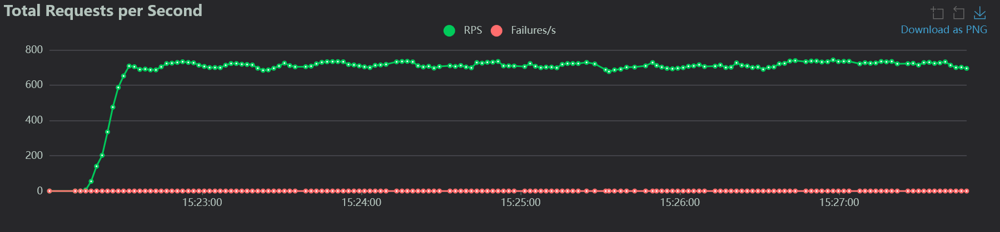
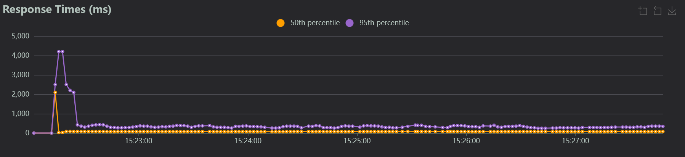
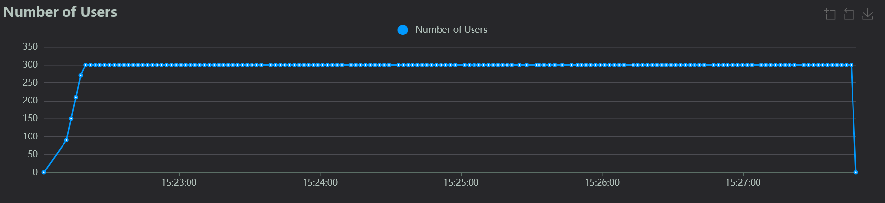

# Микросервис дедупликации событий онлайн кинотеатра KION

## Описание
Микросервис для дедупликации продуктовых событий онлайн-кинотеатра KION (с какого устройства зашли, какие действия выполняли и т.д.) с двухуровневой фильтрацией.\
\
**Основные функции включают**:
- Обработку входящих запросов
- Удаление дубликатов с использованием Redis и Bloom filter
- Хранение данных в PostgreSQL
- Возврат обработанных данных

## Технологии
- Python 3.10+
- FastAPI + Uvicorn (веб-фреймворк)
- xxhash 3.5+ (хэширование для дедуплекации с использованием Redis)
- mmh3 5.1+ (хэширование в фильтре Блума)
- Redis 6.2+ (кеш хэшей событий)
- PostgreSQL 13+ (основное хранилище)
- Alembic 1.7+ (миграции)
- Locust 2.8+ (нагрузочное тестирование)

## Алгоритм дедупликации
1. Из каждого события извлекаются ключевые поля:
    - client_id
    - event_datetime
    - event_name
    - product_id
    - sid
    - r
2. Генерация хэша (xxh3_64) из полученных значений
3. Поиск хэша в Redis → если найден, событие отбрасывается
4. Если не найден → проверка в фильтре Блума (redis + mmh3)
5. Если проходит оба фильтра → сохранение в БД

## Структура проекта
```
KION_dedup/
├── alembic/                   # Миграции базы данных
│   ├── versions/              # Файлы миграций
│   ├── env.py                 # Конфигурация Alembic
│   └── script.py.mako         # Шаблон для генерации миграций
│
├── src/                       # Основной код приложения
│   ├── api/                   # API эндопоинты
│   │   ├── v1/                # Версия API
│   │   │   ├── __init__.py
│   │   │   └──  events.py     # Эндопоинты
│   │   └── __init__.py
│   │
│   ├── core/                  # Конфигурационные файлы
│   │   ├── __init.py__
│   │   ├── bloomfilter.py     # Конфигурация филтра Блума
│   │   ├── config.py          # Конфигурцаии сервиса
│   │   ├── database.py        # Конфигурация баззы данных
│   │   └── redisconfig.py     # Конфигурация Redis
│   │
│   ├── models/                # Модели данных
│   │   ├── __init.py__
│   │   └── events.py          # Модель продуктовых событий
│   │
│   ├── schemas/               # Схемы Pydantic
│   │   ├── __init.py__
│   │   └── events.py          # Схема продуктовых событий
│   │
│   ├── services/              # Бизнес-логика
│   │   ├── __init.py__
│   │   └── events.py          # Логика продуктовых событий
│   │
│   ├── tests/                 # Тесты
│   │   ├── screenshots/       # Скриншоты графиков проведенного нагрузочного тестирования
│   │   │   ├── numbers_of_users.png
│   │   │   ├── response_times.png
│   │   │   └── rps.png
│   │   ├── __init.py__
│   │   ├── locusttest.py      # Нагрузочное тестирование
│   │   └── test_data.json     # Набор тестовых продуктовых событий
│   │
│   └── main.py                # Точка входа в приложение
│
├── .dockerignor               # Игнорируемые файлы Dcker
├── .env                       # Файл окружения
├── .gitignore                 # Игнорируемые файлы Git
├── alembic.ini                # Конфигурация Alembic
├── docker-compose.yml         # Docker конфигурация
├── docker-compose.locust.yml  # Конфигурация Locust
├── Dockerfile                 # Сборка образа FastApi
├── README.md                  # Документация
└── requirements.txt           # Список зависимостей
```

## Установка и запуск
### Локальная установка
1. Клонируйте репозиторий:
   ```bash
   git clone https://github.com/DiMiRka/KION_dedup.git
   cd KION_dedup
   ```
2. Создайте и активируйте виртуальное окружение (рекомендуется):
    ```bash
    python -m venv venv
    source venv/bin/activate  # для Linux/MacOS
    venv\Scripts\activate     # для Windows
   ```
3. Установите зависимости:
    ```bash
    pip install -r requirements.txt
   ```
4. Примените миграции:
   ```bash
   alembic upgrade head
   ```
5. Запустите сервис:
    ```bash
    python src/main.py
   ```
### Запуск через Docker
   ```bash
   docker-compose up --build -d
   ```

## Конфигурация
Сервис использует следующие переменные окружения (указываются в файле .env):
- REDIS_URL - URL для подключения к Redis (формат: redis://default:пароль@хост:порт/номер_базы)
- PG_LINK - URL для подключения к PostgreSQL (формат: postgresql+asyncpg://пользователь:пароль@хост:порт/база_данных)
- POSTGRES_USER - пользователь PostgreSQL
- POSTGRES_PASSWORD - пароль пользователя PostgreSQL
- POSTGRES_DB - имя базы данных PostgreSQL

## Использование
После запуска сервис будет доступен по адресу http://localhost:8000. \
Документация API (Swagger UI) доступна по адресу http://localhost:8000/api/openapi.

### API Endpoints 
- POST /events/event_post:
  - **Назначение**: Отправка событий для дедупликации
  - **Пример тела запроса в формате json**
     ```json
     {
          "platform" : "",
          "event_name" : "on_start_disk_space",
          "profile_age" : -1,
          "user_agent" : "ru.mts.mtstv\/1.1.166.103.5(2025032005)",
          "screen" : "",
          "event_datetime_str" : "2025-04-02 12:04:34",
          "event_datetime" : "2025-04-02T09:04:34.000Z",
          "event_date" : "2025-04-02",
          "auth_method" : "",
          "auth_type" : "",
          "request_id" : "",
          "referer" : "",
          "subscription_name" : "",
          "subscription_id" : "",
          "deeplink" : "",
          "payment_type" : "",
          "transaction_id" : "",
          "purchase_option" : "",
          "content_type" : "",
          "content_gid" : "",
          "content_name" : "",
          "content_id" : "",
          "promocode" : "",
          "promocode_code" : "",
          "quality" : "",
          "play_url" : "",
          "channel_name" : "",
          "channel_id" : "",
          "channel_gid" : "",
          "cause" : "",
          "button_id" : "",
          "button_text" : "",
          "feedback_text" : "",
          "experiments" : "['hw_channels_shelf_from_mgw:true','hw_show_tv_bookmarks_tab:true','moneta_tcldevices_promo_subs_1rub:true','AI_Voices_actors_on_pause_enabled:true','moneta_prime_onboarding:0','player_is_mediavitrina_analytics_enabled:true','hw_fav_channels_meta_from_mgw:true','auth_type:websso','moneta_offer_after_unsubs:1','moneta_qrcard_enabled:true','player_core_amount_observation_exo_player_provider:2','show_zero_series:true','Auth_animation_suc:1','waterbase_enabled:true','Ai_Voices_music:on','moneta_haierdevices_promo_subs_1rub:true','moneta_is_svodpreview_price_visible:true','autoscroll_time:7000','one_step_link_card_enabled:true','similar_shelf_source:mgw','original_screensaver_enabled:true','hw_auto_off_tv_time_period:14400000','vitrina_check_age_not_auth:true','Auth_pin_redisign_enabled:true','player_tv_subtitles:true','hw_channel_packages_shelf:2','show_catchup_bookmark:true','moneta_promocode_iptv_visible:false','vitrina_check_rkn_pin:false','vitrina_long_click_menu:true','moneta_subscription_button_activate:false','Setting_view_show_kionostories_2_0_enable:true','CIS_authorization_enabled:false','moneta_short_svod_wo_subs:false','first_purchase_opt:sd','moneta_hyundaidevices_promo_subs_1rub:false','new_purchase_enabled:true','hw_catchup_shelf_status:2','vitrina_avod_display_enabled:true','vitrina_favorite_vod_provider:mgw','ai_voices_child_mode_slider_enabled:true','Auth_premium_status_enabled:false','hw_time_to_display_auto_off:120000','hw_programs_meta_from_mgw:true','ecosystem_profile:1','filter_api_provider:mgw','moneta_short_svod_trial:false','hw_show_tv_guide_button:true','vitrina_use_rkn_pin_cache:false','original_videoshelf_enabled:true','glagne_filter:yes','vitrina_check_pc_pin:true','moneta_pay_promo_immediate:false','series_trailers_enable:true','moneta_xiaomidevices_promo_subs_1rub:false','vitrina_bookmarks_provider:mgw','moneta_parent_pin_enable:true','moneta_cashback_hide:true','Auth_party_station:true','hw_tv_timer_auto_off:true','hw_now_on_tv_shelf_from_mgw:true','moneta_contra_offer_trial:false','subscriptions_design:new','player_core_is_enable_observation_exo_player_provider:true','Auth_delete_acc_enabled:true','hw_tv_page_from_mgw:true','moneta_promocode_new_cjm_enabled:true','search_api_provider:mgw','Auth_websso_access_token_status:1','moneta_sberdevices_promo_subs_1rub:true','hw_channels_meta_from_mgw:true','moneta_kvantdevices_promo_subs_1rub:true','moneta_subscription_price_visible:true']",
          "season" : "",
          "episode" : "",
          "discount_items_ids" : "[]",
          "discount_items_names" : "[]",
          "content_provider" : "",
          "story_type" : "",
          "userId" : "",
          "playtime_ms" : null,
          "duration" : null,
          "client_id" : "0b9dbdaffc477990",
          "discount" : "[]",
          "is_trial" : null,
          "price" : 0,
          "dt_add" : "2025-04-02T07:05:20.502Z",
          "url_user_event" : "",
          "event_receive_timestamp" : 1743577520,
          "event_receive_dt_str" : "2025-04-02 10:05:20.498966",
          "shelf_name" : "",
          "shelf_index" : null,
          "card_index" : null,
          "error_message" : "",
          "platform_useragent" : "",
          "product_id" : "c02bf98d-295a-4903-b690-02a6b97bb96c",
          "dl" : "",
          "fp" : "",
          "dr" : "",
          "mc" : 6,
          "r" : "7678972391743577474",
          "sc" : 1,
          "sid" : "3164791831743577458",
          "sr" : "1920x1080",
          "title" : "",
          "ts" : "2025-04-02T12:04:34.794+05:00",
          "wr" : "",
          "cid" : "",
          "uid" : "prod.086223f9f38245fd822dff8c261",
          "ll" : "",
          "av" : "",
          "os" : "Android",
          "mnf" : "ARCELIK",
          "mdl" : "Grundig Google TV",
          "os_family" : "Other",
          "os_version" : "",
          "is_mobile" : 0,
          "is_pc" : 0,
          "is_tablet" : 0,
          "is_touch_capable" : 0,
          "client_id_body" : "",
          "client_id_query" : "0b9dbdaffc477990",
          "time" : 0,
          "field_id" : "",
          "field_action" : "",
          "search_films" : "[]",
          "recommended_films" : "[]",
          "event_datetime_msc" : null,
          "user_device_is_tv" : 1,
          "input_type" : "",
          "product_names" : "[]",
          "product_ids" : "['[]']",
          "prices" : "['[]']",
          "auth_status_list" : "",
          "isJunior" : "",
          "waterbase_device_id" : "0b9dbdaffc477990",
          "error_url" : "",
          "error_severity" : 999,
          "error_category" : 999,
          "error_code" : "",
          "os_build" : "",
          "banner_type" : "",
          "banner_id" : "",
          "banner_gid" : "",
          "kion_session_id" : "",
          "popup_name" : "",
          "popup_action" : "",
          "app_version" : "1.1.166.103.5",
          "downloaded" : -25,
          "osv" : "11",
          "dt" : "androidtv-tvapp-ott",
          "dm" : "ANDROIDTV_WIDEVINE_VMX_v2",
          "lc" : "ru-RU",
          "event_source" : "",
          "device_id" : "",
          "debug" : false,
          "host" : "",
          "path" : "",
          "request_type" : "",
          "code" : "",
          "message" : "",
          "field_text" : "",
          "card_gid" : "",
          "current_time" : null,
          "card_id" : "",
          "card_type" : "",
          "card_name" : "",
          "uuid" : "",
          "term" : "",
          "playing_mode" : "",
          "inserted_dt" : "2025-04-02T07:05:24.000Z",
          "build_model" : "Grundig Google TV",
          "build_manufacturer" : "ARCELIK",
          "extra_field" : "",
          "trouble_report" : "",
          "playback_speed" : ""
      }
     ```
  - **Ответ**: Если событие уникально "Event added + json событие", если дубликат "Duplicate filtered out"
  
- GET /events/get_events:
  - **Назначение**: Получение последних 10 уникальных событий.
  - **Ответ**: Массив событий в формате JSON.

## Нагрузочное тестирование
Тестирование проводится с помощью Locust.

### Запуск тестирования
1. Запустите тестирование:
    ```bash
    locust -f src/tests/locusttest.py --host=http://localhost:8000
    ```
2. Откройте веб-интерфейс Locust:
http://localhost:8089
3. Укажите параметры теста:
- **Number of users**: Количество юзеров при пиковой нагрузке
- **Spawn rate**: Подключение пользователей в секунду
- **Host**: http://localhost:8000

### Результаты проведенного тестирования
#### Конфигурация теста
- **Number of users**: 300
- **Spawn rate**: 30
- **Host**: http://localhost:8000
#### Аппаратные характеристики локальной машины
- **Процессор (CPU):** AMD Ryzen 7 5800HS with Radeon (8 ядер, 16 потоков)
- **Оперативная память (RAM):** 32 GB DDR4 3200 MHz
- **ОС:** Windows 10 

#### Ключевые метрики

| Метрика                   | GET /events/get_events | POST /events/event_post | Общие     |
|---------------------------|------------------------|-------------------------|-----------|
| Среднее время ответа (мс) | 215                    | 76                      | 122       |
| Максимальное время (мс)   | 2712                   | 4375                    | 4375      |
| Медианное время (мс)      | 190                    | 61                      | 74        |
| Запросов в секунду (rps)  | 232.78                 | 464.97                  | 697.76    |
| Ошибок                    | 0 (0.00%)              | 0 (0.00%)               | 0 (0.00%) |

#### Перцентили времени ответа
**GET /events/get_events**

| Перцентиль | 50% | 66% | 75% | 80% | 90% | 95% | 98% | 99% | 99.9% | 100% |
|------------|-----|-----|-----|-----|-----|-----|-----|-----|-------|------|
| Время (мс) | 190 | 230 | 260 | 290 | 370 | 470 | 570 | 660 | 2100  | 2700 |

**POST /events/event_post**

| Перцентиль | 50% | 66% | 75% | 80% | 90% | 95% | 98% | 99% | 99.9% | 100% |
|------------|-----|-----|-----|-----|-----|-----|-----|-----|-------|------|
| Время (мс) | 61  | 69  | 76  | 84  | 110 | 130 | 190 | 290 | 2200  | 4400 |

#### Графики производительности
**RPS (запросов в секунду)**


**Response Times (время ответа)**


**Numbers of Users (количество пользователей)**


#### Выводы
1. Система стабильно обрабатывает **~700 запросов/сек** при 300 одновременных пользователях
2. **95% запросов** выполняются быстрее 330 мс
3. Нет зафиксированных ошибок (0% failure rate)
4. Пиковые значения времени ответа (до 4400 мс) требуют дополнительного анализа
